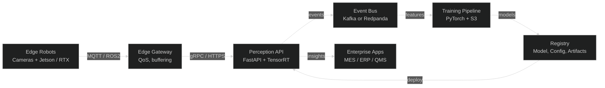
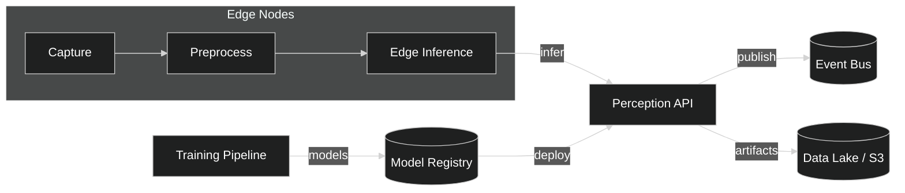
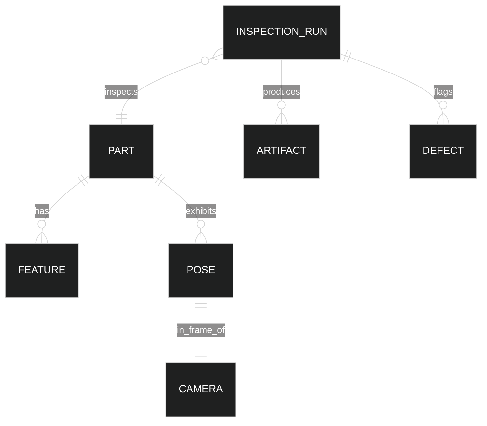
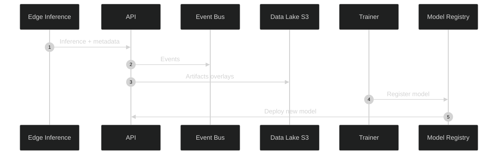
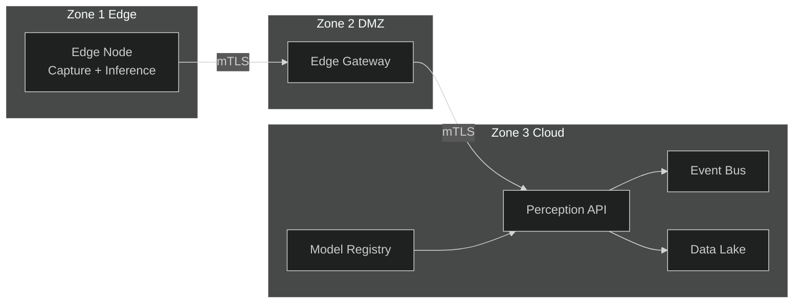

# Global Architecture Overview

RoboCaps spans edge perception, cloud training/evaluation, and enterprise integration. This overview summarizes cross-system patterns, interfaces, and governance.

## Assumptions
- Edge nodes have GPU acceleration and reliable power; connectivity may be intermittent.
- Camera triggering, part catalogs, and acceptance criteria are under change control.
- Data retention policies permit storage of overlays and anonymized frames for audit.

## Non-Functional Requirements
- Latency: edge p50 < 60 ms, p99 < 120 ms (224×224 inference).
- Availability: > 99.5% for API and edge agents during shifts.
- Security: mTLS, signed artifacts, SBOM/scans, least-privilege identities.
- Observability: metrics, logs, traces with trace ID propagation.

## C4 Context

## C4 Container View
The platform comprises edge nodes, an ingress/API layer, an event backbone, a data lake, a training pipeline, and a model registry that feeds deployments.

## Information Model (ER)
`InspectionRun` ties input frames to decisions and artifacts for audit.

## Data Lifecycle

## Trust Zones and Deployment
Separate concerns to minimize blast radius and meet compliance requirements.

## Data Contracts (Global)
- Pose: `{part_id, tx, ty, theta | tz, qw, qx, qy, qz, confidence}`
- Decision event: `{run_id, parts, poses, decision, model_version, trace_id}`
- Artifact: `{run_id, overlay_uri, created_at}`

## Security Model
- Artifact signing; verify on load; SBOM for images
- mTLS with short-lived credentials (rotated)
- RBAC for API and artifact store

## Observability
- Prometheus: latency, throughput, errors, GPU metrics
- Structured logs with trace IDs and run IDs
- Tracing: capture→decision correlation via OTLP

## Failure Modes and Mitigations
- Connectivity loss: local buffering and reconciliation
- Model regression: canary deploy with automated rollback criteria
- Resource saturation: autoscaling, rate limiting, reduced resolution fallback

## Capacity and Versioning
- Version models/configs with semver + git SHA
- Capacity plan using peak frames per second and object count per frame
