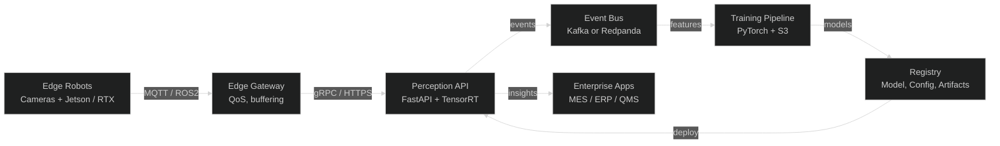
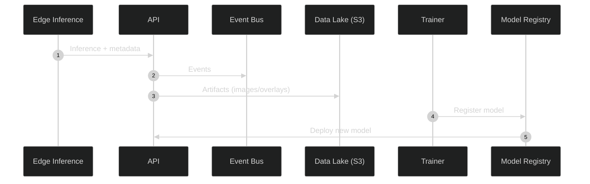
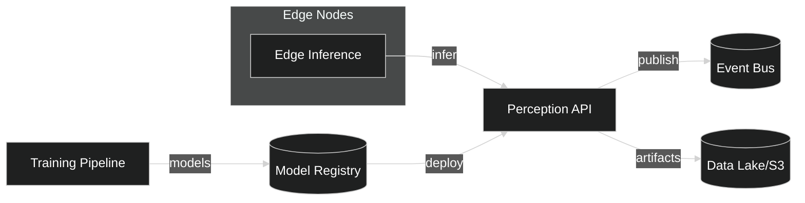
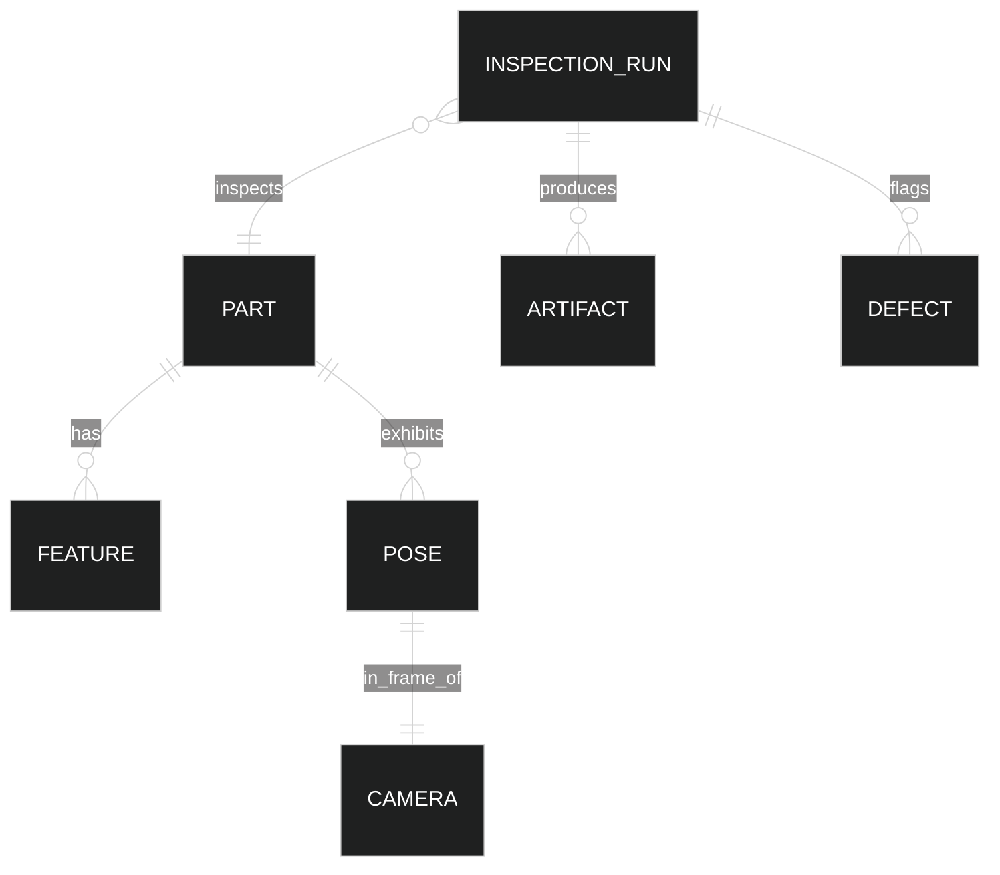

# Global Architecture Overview

RoboCaps spans edge perception, cloud training/evaluation, and enterprise integration. This overview summarizes cross-system patterns, interfaces, and governance.

## C4 Context

## Cross-Cutting Concerns
- Observability: metrics (Prometheus), traces (OTLP), logs (JSON).
- Security: mTLS, JWT/OIDC, least-privilege IAM, SBOMs, image scanning.
- Data: S3-compatible object store, data retention, PII redaction.
- Model lifecycle: versioning (semver+git sha), canary, rollback, A/B.

## Governance
- Change management: RFCs, risk gates, model cards, datasheets.
- Compliance: ISO 26262 (as applicable), IEC 62443, SOC2-friendly controls.

## Data Lifecycle

## C4 Container View
The platform comprises edge nodes, an ingress/API layer, an event backbone, a data lake, a training pipeline, and a model registry that feeds deployments.

## Information Model (ER)
This model underpins event schemas and storage. `InspectionRun` ties input frames to decisions and artifacts for audit.

