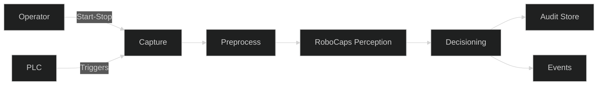
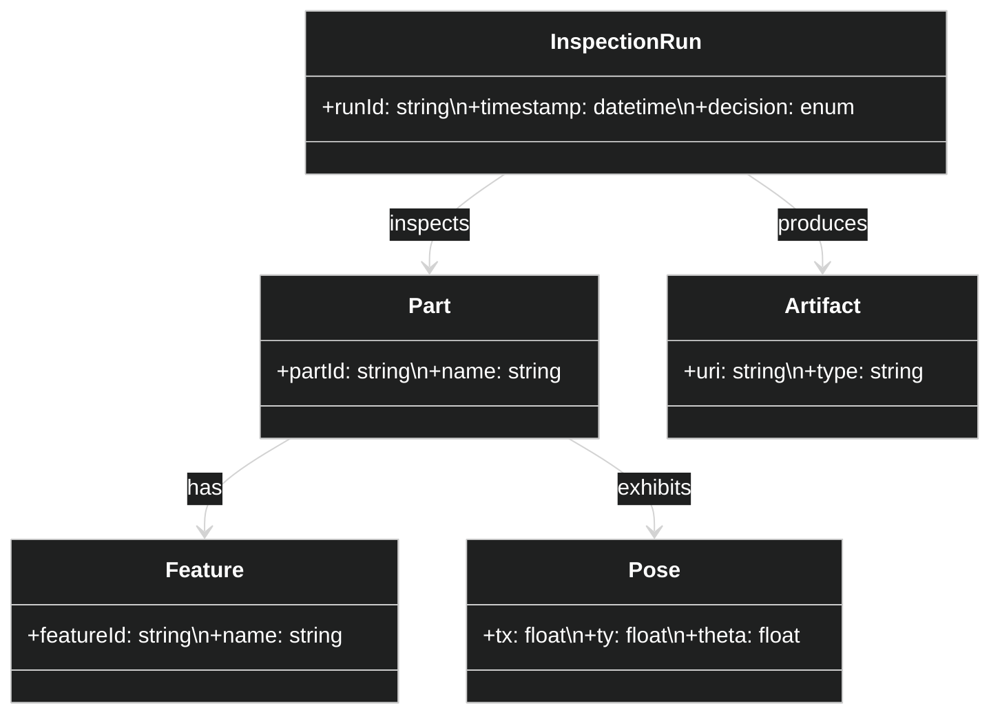

# Factory QA — Conceptual

## Goals and Scope
Deliver explainable, low-latency inspection for parts on production lines with structured part–pose outputs and auditable decisions. Scope includes camera capture, local inference, decisioning, and enterprise integration.

## Stakeholders and Roles
- Operators: run lines; need clear pass/fail and overlays.
- QA Engineers: configure thresholds; analyze defects and trends.
- Manufacturing Engineers: maintain system availability and throughput.
- Compliance/Governance: require audit trails and change control.

## Assumptions
- Deterministic triggers are available (PLC or encoder-based) for capture alignment.
- Edge node has GPU acceleration (Jetson/x86) and intermittent connectivity.
- Part catalogs and acceptance criteria are codified and versioned.

## Non-Functional Requirements (NFRs)
- Latency: p50 < 60 ms per frame at 224×224; p99 < 120 ms.
- Availability: > 99.5% during production shifts with graceful degradation.
- Explainability: pose overlays and reasoning traces per decision.
- Security: mTLS edge→cloud; signed models; SBOM and image scans.
- Observability: Prometheus metrics, structured logs, and trace IDs.

## High-Level Process
- Capture frames on triggers → preprocess → infer capsules → decide → emit events → persist overlays/audit.

## Risks and Mitigations
- Occlusion/clutter: capsule agreement and pose priors; multi-view if available.
- Drifts in lighting/camera: domain monitors and automated thresholds.
- Model updates risk: canary deploy, A/B with rollbacks; model cards.

## Context Diagram

## Domain Model (Class Diagram)

## Justification of Approach
Capsule heads produce structured part–pose outputs with interpretable routing, aligning decisions to physical geometry. Attention-based routing leverages modern accelerators while preserving agreement, giving robustness under viewpoint changes and occlusion.
