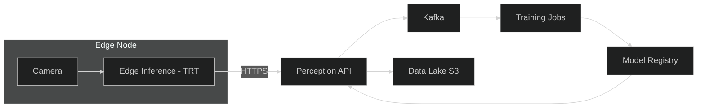

# Factory QA — Implementable

## Components and Responsibilities
- Capture: interface with cameras/PLC; timestamping and trigger control
- Preprocess: resize, normalize, optional ROI; GPU-aware input pipeline
- Inference: ONNX/TensorRT engine execution; batching (1) and warmup
- Decision: thresholds per part; rule-based aggregation; write overlays
- Gateway: local MQ, retries, edge buffering, TLS termination
- API: FastAPI endpoints, schema validation, metrics exporter

## Deployment Topology
- Edge node: Capture, Preprocess, Inference, Gateway (systemd or containerized)
- Cloud: API deployment (K8s with GPU pool), Event Bus (Kafka), Object Store (S3), Observability stack

## Configuration
- Models: versioned URIs; checksum enforcement
- Thresholds: per-part and global; remotely updatable via config topic
- Security: certificates rotation; registry credentials for pulling images

## Failure Modes and Handling
- Camera offline: raise alerts, continue with cached last-good config
- GPU OOM: drop to reduced resolution; circuit-breaker on API
- Connectivity loss: buffer locally; reconcile upon reconnect

## SLOs
- p50 latency < 60 ms; p99 < 120 ms
- Decision accuracy per part tracked over sliding window; alert on drift

## Helm Values (excerpt)
```yaml
image:
  repository: ghcr.io/your-org/robocaps-api
  tag: latest
resources:
  limits:
    nvidia.com/gpu: 1
  requests:
    cpu: 500m
    memory: 1Gi
    nvidia.com/gpu: 1
env:
  - name: MODEL_URI
    value: s3://models/robocaps/latest/robocaps.plan
```

## Deployment Diagram

