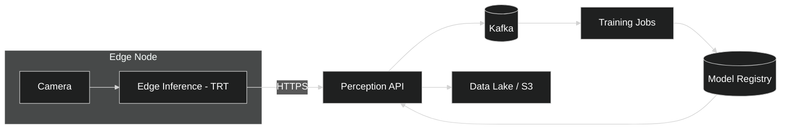

# Factory QA — Implementable (RM-ODP)

## Technical Stack
- Edge: Jetson Xavier/Orin (TensorRT), or x86 + RTX.
- API: FastAPI + Uvicorn, gRPC optional for high-throughput streams.
- Messaging: ROS2 Foxy/Humble or MQTT; Kafka cloud bus.

## Config Samples
```yaml
# edge_config.yaml
camera:
  topic: cam/image_raw
  fps: 30
inference:
  engine: trt
  model_uri: s3://models/robocaps/latest/robocaps.plan
  batch_size: 1
output:
  mqtt_topic_poses: qa/poses
  mqtt_topic_defects: qa/defects
```

## API Endpoints (FastAPI)
- POST `/infer`: image bytes → JSON poses and confidences
- GET `/healthz`: liveness
- GET `/metrics`: Prometheus exporter

## Deployment Notes
- Kubernetes: GPU node pool, tolerations and resource limits for TRT pods.
- Observability: scrape metrics, forward logs; attach trace ids to events.
- Security: mTLS between gateway and API; short-lived tokens for edge.

## Deployment Diagram

