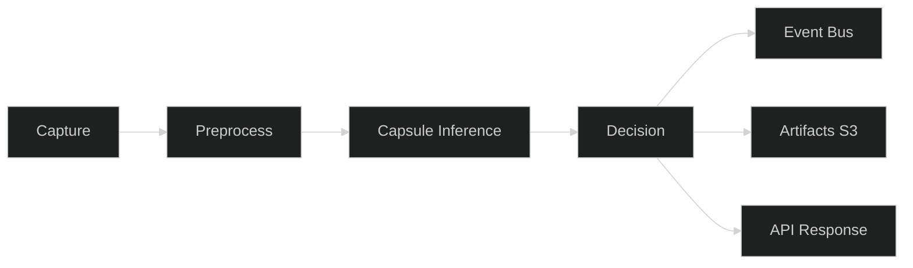
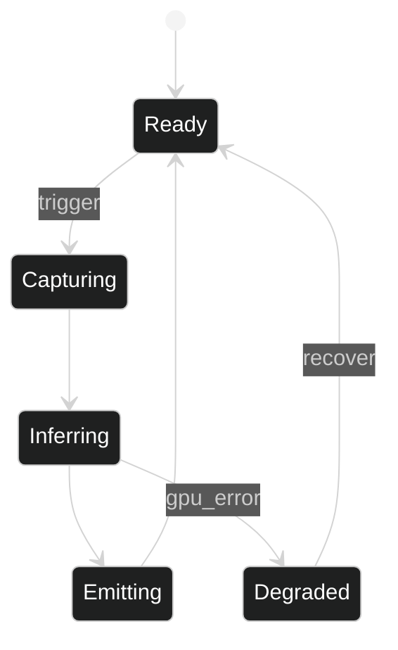

# Factory QA — Logical

## Interfaces
- HTTP API: POST /infer (image bytes or URI) → {parts: [id, prob], poses: [tx,ty,theta], overlays}
- MQTT/ROS2: topics `cam/image_raw`, `qa/poses`, `qa/defects`, `qa/audit`
- Storage: S3-compatible bucket for artifacts; Kafka topic `qa.events` for decisions

## Data Contracts
- Pose schema: `{part_id: string, tx: float, ty: float, theta: float, confidence: float}`
- Audit record: `{run_id, timestamps, input_ref, output_json, overlay_uri, model_version}`
- Health/metrics: `/healthz` returns status; `/metrics` exposes Prometheus counters/histograms

## Workflow
1) Capture → 2) Preprocess (normalize, crop) → 3) Inference (capsules) → 4) Decision (thresholds, rules) → 5) Emit (events, overlays) → 6) Persist (audit)

## Error Handling
- Input validation: reject oversized/invalid formats with 4xx
- Backpressure: gateway buffer with retries; at-least-once delivery to cloud
- Dead-letter topic for failed events

## Scaling
- Edge: batch size 1; multiple lines = multiple edge agents
- Cloud API: HPA on CPU/GPU; shard by production line/zone
- Event bus and object store scale independently

## Security
- mTLS for edge→cloud; short-lived JWTs
- Signed models; SBOM and image scans in CI
- Role-based access for API and artifacts

## Observability
- Prometheus: latency, throughput, error rates, GPU utilization
- Logs: JSON with trace IDs; push to central log store
- Traces: OTLP exporter; correlate capture→decision path

## Data Flow (detailed)

## State Machine (Edge Agent)

