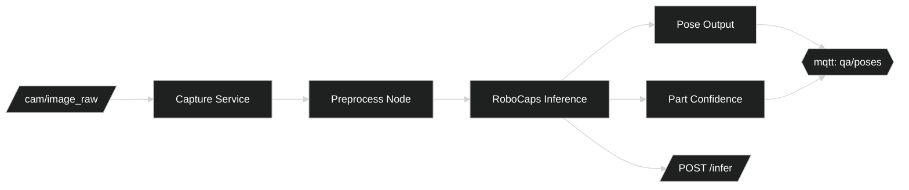

# Factory QA — Logical (RM-ODP)

## Interfaces
- `/infer` (HTTP POST, FastAPI): image, config → part/pose outputs.
- ROS2 topics: `cam/image_raw`, `qa/poses`, `qa/defects`.
- MQTT topics: `qa/poses`, `qa/defects`, `qa/audit`.

## Contracts
- Pose schema: `{part_id, T_cam_part (SE3), confidence}`.
- Audit record: `{run_id, timestamps, inputs_hash, outputs, overlays_uri}`.

## Workflows
- Capture → Preprocess → Infer → Decide → Emit events → Persist artifacts.

## Reliability
- Backpressure via gateway buffers, at-least-once delivery, idempotent sink.

## Component/Data Flow

