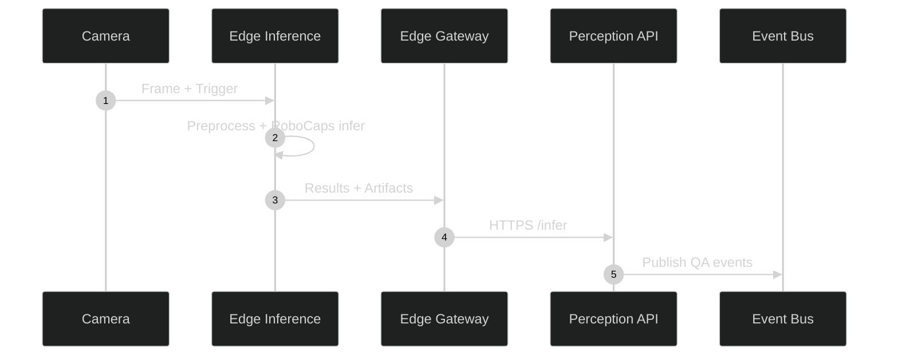
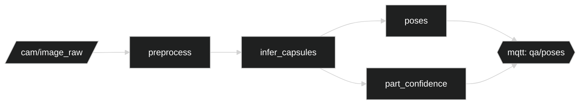
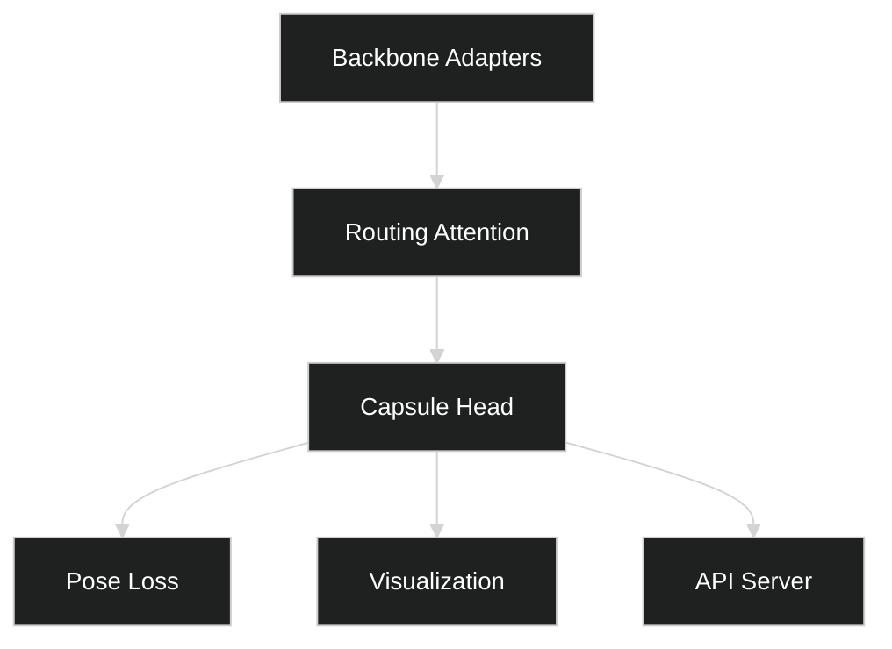

# Factory QA Architecture Diagrams

## Sequence (Inspection Cycle)

```mermaid
%%{init: { 'theme': 'dark', 'themeVariables': { 'background':'#000', 'primaryTextColor':'#FFF', 'textColor':'#FFF', 'fontSize':'14px' }}}%%
sequenceDiagram
    autonumber
    participant Cam as Camera
    participant Edge as Edge Inference
    participant GW as Edge Gateway
    participant API as Perception API
    participant Bus as Event Bus
    Cam->>Edge: Frame + Trigger
    Edge->>Edge: Preprocess + RoboCaps infer
    Edge->>GW: Results + Artifacts
    GW->>API: HTTPS /infer
    API->>Bus: Publish QA events
```

## Data Flow (ROS2/MQTT Topics)

```mermaid
%%{init: { 'theme': 'dark', 'themeVariables': { 'background':'#000', 'primaryTextColor':'#FFF', 'textColor':'#FFF', 'fontSize':'14px' }}}%%
flowchart LR
    CAM[/cam/image_raw/] --> PRE[preprocess]
    PRE --> INF[infer_capsules]
    INF --> P[poses]
    INF --> C[part_confidence]
    P --> OUT{{mqtt: qa/poses}}
    C --> OUT
```

## Module Dependencies

```mermaid
%%{init: { 'theme': 'dark', 'themeVariables': { 'background':'#000', 'primaryTextColor':'#FFF', 'textColor':'#FFF', 'fontSize':'14px' }}}%%
graph TD
    B[Backbone Adapters] --> R[Routing Attention]
    R --> H[Capsule Head]
    H --> L[Pose Loss]
    H --> V[Visualization]
    H --> S[API Server]
```
