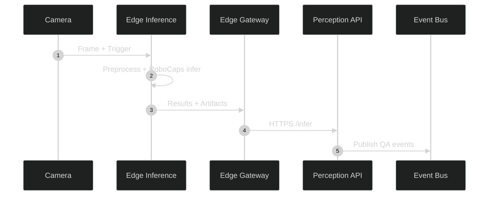
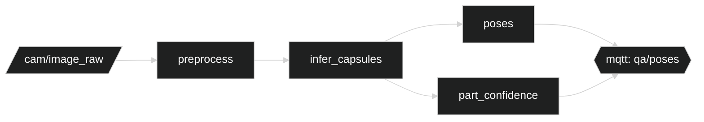
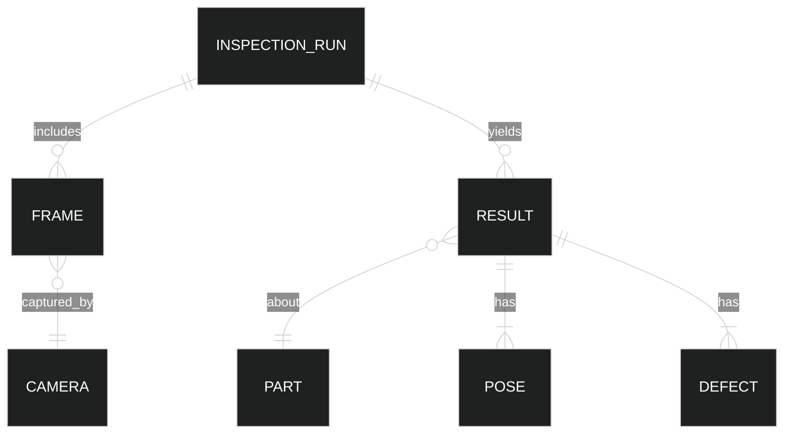
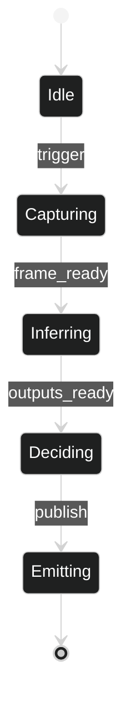
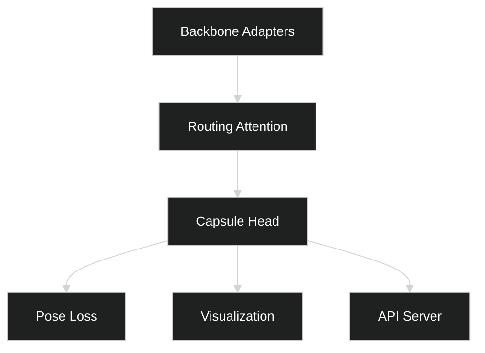

# Factory QA Architecture Diagrams

## Sequence (Inspection Cycle)


The inspection cycle starts on hardware triggers, runs local inference for latency, publishes decisions upstream, and persists overlays for audit.

## Data Flow (ROS2/MQTT Topics)


## Container View (C4)
```mermaid
%%{init: { 'theme': 'dark', 'themeVariables': { 'background':'#000', 'primaryTextColor':'#FFF', 'textColor':'#FFF', 'fontSize':'16px' }}}%%
flowchart LR
  subgraph Edge[Edge]
    cap[Capture]
    pre[Preprocess]
    inf[Inference (TRT)]
  end
  api[Perception API]:::svc
  bus[(Events)]:::queue
  art[(Artifacts/S3)]:::store
  cap-->pre-->inf-->api
  api-->bus
  api-->art
  classDef svc fill:#111,stroke:#888,color:#FFF;
  classDef queue fill:#000,stroke:#888,color:#FFF;
  classDef store fill:#000,stroke:#888,color:#FFF;
```

## Entity-Relationship (QA Domain)


## State Machine (Run Lifecycle)


## Module Dependencies

