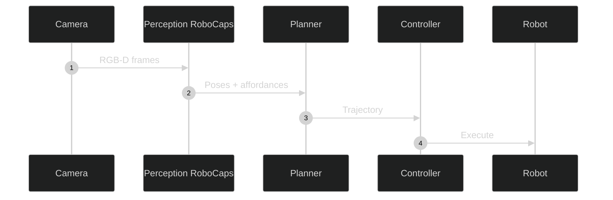
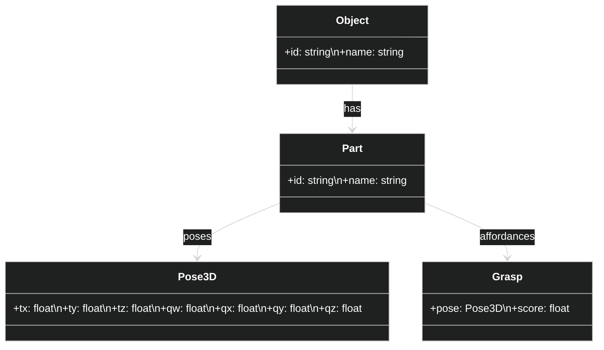

# Robot Manipulation — Conceptual

## Goals and Scope
Enable reliable grasping, assembly, and tool-use via structured part–pose perception with interpretable outputs and real-time constraints.

## Stakeholders
- Operators: safe execution; quick recovery from failures
- Process/Automation Engineers: throughput, success rate, changeovers
- Safety Officers: adherence to safety standards and guardrails

## Assumptions
- Wrist/overhead cameras with synchronized time; robot controllers expose state
- GPU acceleration available on the workcell controller or adjacent node
- Known part catalogs or CAD proxies for pose validation

## NFRs
- Latency: perception→plan handoff < 100 ms for common pick tasks
- Reliability: grasp success rate within target ranges with pose uncertainty modeled
- Safety: conservative fallbacks; safe stop integration

## Risks and Mitigations
- Dynamic scenes: replan with updated poses; multi-view fusion optional
- Lighting variability: domain monitors; adaptive thresholds
- Tool wear and drift: periodic calibration checks

## Perception-to-Action Sequence

## Domain Model (Class Diagram)

## Justification
Capsule heads with SE(3) outputs align directly with planning frames; interpretability aids failure analysis and process improvement.
