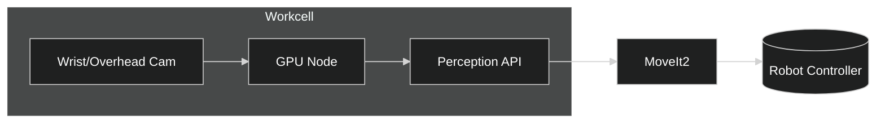

# Robot Manipulation — Implementable (RM-ODP)

## Technical Stack
- Perception: RoboCaps + TensorRT for low-latency inference.
- Planning: MoveIt2, OMPL; optional gRPC planning service.
- Control: ROS2 controllers, real-time kernel when applicable.

## Config Samples
```yaml
perception:
  engine: trt
  model_uri: s3://models/robocaps/manipulation/robocaps.plan
planning:
  planner: ompl
  timeout_s: 2.0
```

## Deployment Notes
- Synchronize time across sensors and robot controllers (NTP/PTP).
- Isolate GPU inference from planning threads.
- Record audit trails for executed grasps and outcomes.

## Deployment Diagram

