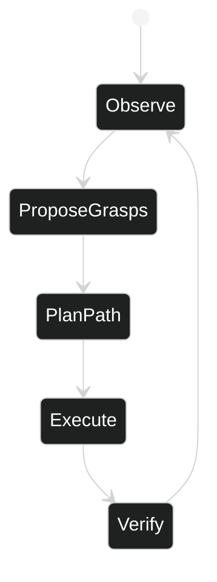

# Robot Manipulation — Logical

## Interfaces
- ROS2 topics: `camera/color`, `capsules/poses`, `grasp_candidates`, `joint_states`
- gRPC: `PlanTrajectory(poses) -> trajectory`
- HTTP: `/infer` for testing and debug; `/healthz`, `/metrics`

## Data Schemas
- Pose3D: `{tx,ty,tz,qw,qx,qy,qz,confidence}`
- GraspCandidate: `{pose: Pose3D, score: float, approach: vec3}`
- Trajectory: `{waypoints: [...], duration}`

## Workflow
Perception updates → affordance generation → planning → execution → verification → loop with updated scene.

## Error Handling
- Pose uncertainty: replan or lower-speed execution
- Planner timeout: fallback grasp set; safe stop if none valid
- Controller error: abort trajectory; notify operator

## Scaling
- Perception on GPU node; planner can be CPU with OMPL; optional distributed planning

## Security & Observability
- mTLS between services; role-scoped permissions
- Prometheus metrics: perception latency, plan time, success rate
- Logs: structured with trace and run IDs

## Data Flow

## State Machine

