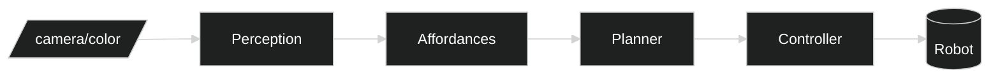

# Robot Manipulation — Logical (RM-ODP)

## Interfaces
- ROS2 topics: `camera/color`, `capsules/poses`, `grasp_candidates`, `joint_states`.
- gRPC service: `PlanTrajectory(poses) -> trajectory`.

## Contracts
- Pose schema and grasp candidate schema (pose, score, approach vector).

## Workflows
- Perception updates → recompute grasp set → plan trajectory → execute → verify.

## Reliability
- Time-synced frames, watchdog timers, safe stop hooks.

## Components

