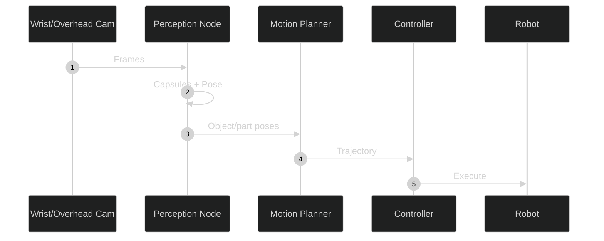
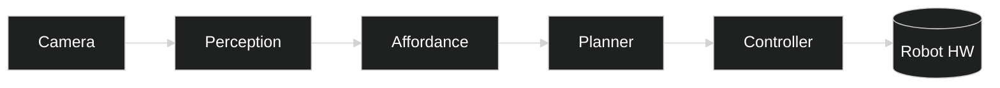
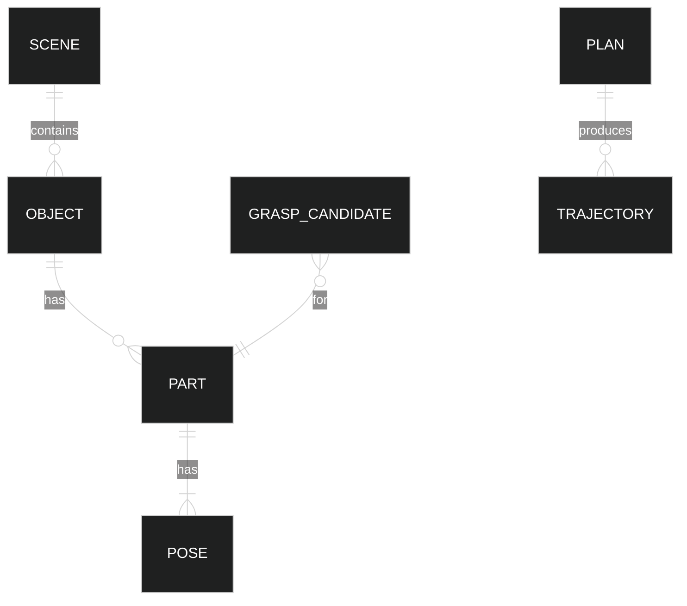
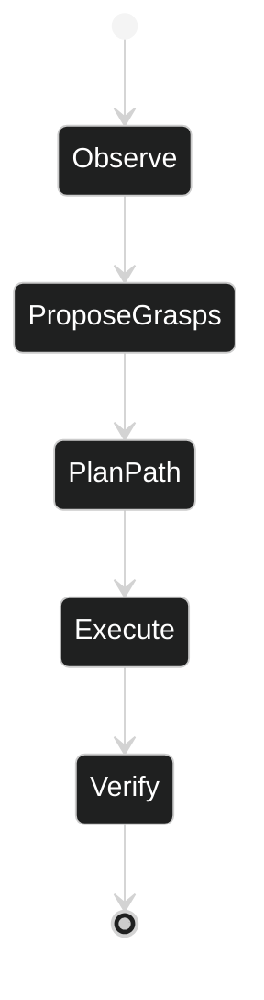
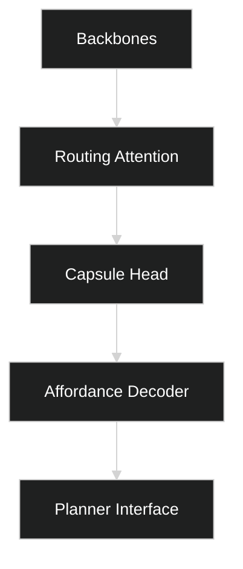

# Robot Manipulation Architecture Diagrams

## Sequence (Perception-to-Grasp)

## Container View (C4)

## Entity-Relationship (Manipulation Domain)

## State Machine (Grasp Attempt)

## Data Flow (ROS2 Topics)

## Module Dependencies

