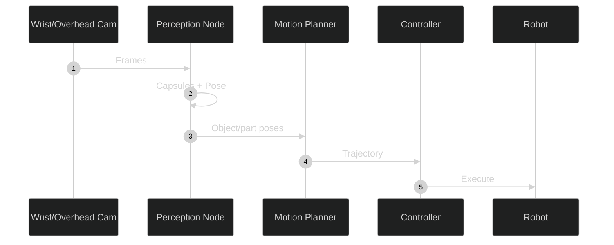
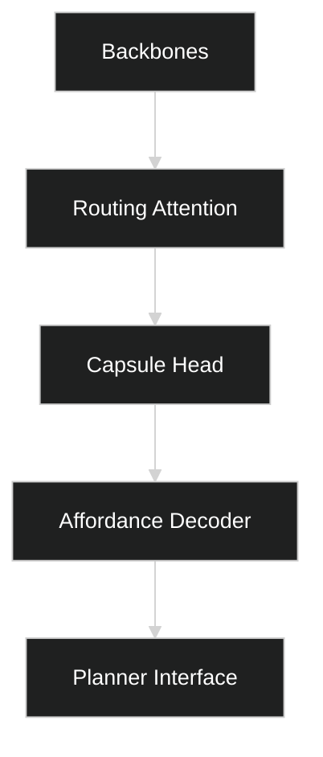

# Robot Manipulation Architecture Diagrams

## Sequence (Perception-to-Grasp)

```mermaid
%%{init: { 'theme': 'dark', 'themeVariables': { 'background':'#000', 'primaryTextColor':'#FFF', 'textColor':'#FFF', 'fontSize':'14px' }}}%%
sequenceDiagram
    autonumber
    participant Cam as Wrist/Overhead Cam
    participant Per as Perception Node
    participant Plan as Motion Planner
    participant Ctrl as Controller
    Cam->>Per: Frames
    Per->>Per: Capsules + Pose
    Per->>Plan: Object/part poses
    Plan->>Ctrl: Trajectory
    Ctrl->>Robot: Execute
```

## Data Flow (ROS2 Topics)

```mermaid
%%{init: { 'theme': 'dark', 'themeVariables': { 'background':'#000', 'primaryTextColor':'#FFF', 'textColor':'#FFF', 'fontSize':'14px' }}}%%
flowchart LR
    CAM[/camera/color/] --> PER[perception_capsules]
    PER --> POSE[poses]
    POSE --> GRASP[grasp_candidates]
    GRASP --> PLAN[/move_group/goal/]
```

## Module Dependencies

```mermaid
%%{init: { 'theme': 'dark', 'themeVariables': { 'background':'#000', 'primaryTextColor':'#FFF', 'textColor':'#FFF', 'fontSize':'14px' }}}%%
graph TD
    B[Backbones] --> R[Routing Attention]
    R --> H[Capsule Head]
    H --> A[Affordance Decoder]
    A --> P[Planner Interface]
```
