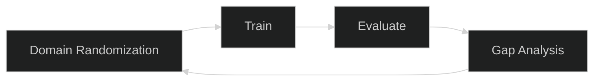
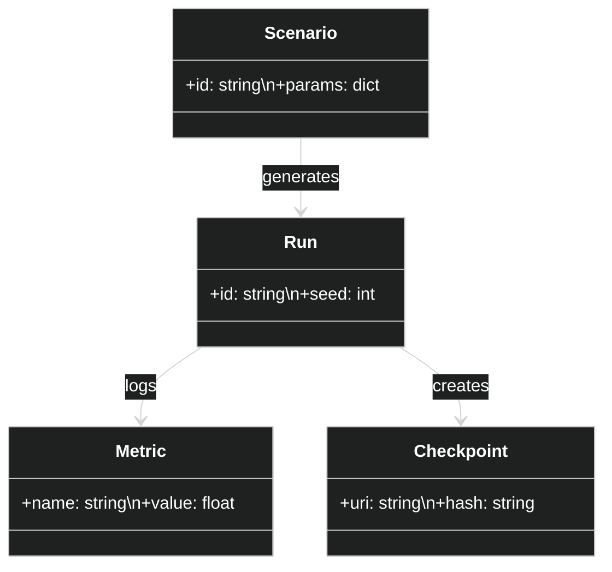

# Sim2Real — Conceptual

## Goals and Scope
Shrink the gap between simulated and real deployments by designing training and evaluation loops that emphasize pose stability, compositional understanding, and auditability.

## Stakeholders
- Research: dataset curation, domain randomization
- QA/Operations: confidence in transfer and performance envelopes

## Assumptions
- Access to a simulator (Isaac/Unreal) with controllable domain parameters
- Real-world evaluation datasets with pose ground truth or proxies

## NFRs
- Reproducibility: seeds and configs tracked; artifacts versioned
- Comparability: standardized metrics (ADD/ADD-S, equivariance error)

## Risks
- Over-randomization reducing relevance: monitor gap metrics
- Simulator bias: incorporate real captures into evaluation

## Iterative Loop

## Domain Model (Class Diagram)

