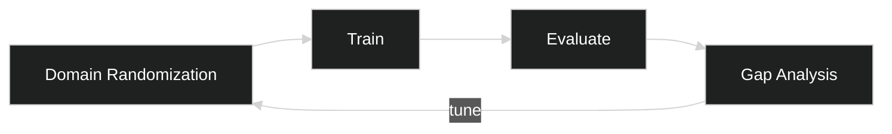

# Sim2Real — Conceptual (RM-ODP)

## Enterprise Viewpoint
- Goal: Reduce deployment risk by validating models against realistic variations.
- Stakeholders: Research, QA, Operations.

## Information Viewpoint
- Entities: Scenario, DomainParams, Model, Metric, GapReport.

## Computational Viewpoint (conceptual)
- Services: Synthetic Data Gen, Training, Evaluation, Adaptation.
- Interactions: Iterative loop to shrink sim-to-real gap.

## Iterative Loop

