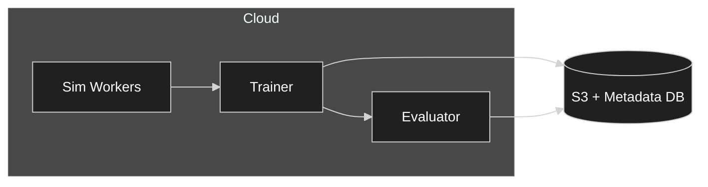

# Sim2Real — Implementable (RM-ODP)

## Technical Stack
- Simulation: Isaac Sim or Unreal-based pipelines.
- Training: PyTorch DDP, mixed precision.
- Storage: S3-compatible; metadata DB for runs.

## Config Samples
```yaml
training:
  batch_size: 64
  lr: 3e-4
  epochs: 50
sim:
  domain_randomization: true
  params: [lighting, texture, pose, occlusion]
```

## Deployment Notes
- Use containerized sim workers on GPU nodes.
- Track provenance for synthetic assets and seeds.
- Automate regression against real eval suites.

## Deployment Diagram

