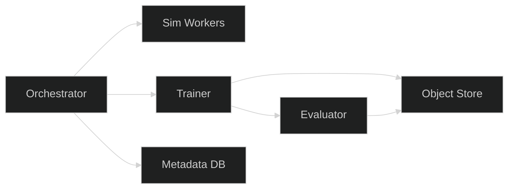

# Sim2Real — Implementable

## Components
- Simulation Workers: distributed GPU containers generating synthetic data
- Trainer: DDP, mixed precision; logs to object store and metadata DB
- Evaluator: runs standardized metrics on real datasets; emits overlays
- Orchestrator: queues runs; enforces quotas and retention

## Infrastructure
- Kubernetes GPU node pool for sim and train
- Object store (S3) and metadata database (PostgreSQL)
- CI/CD for containers and SBOMs

## Configuration
- Domain parameters catalog; randomization ranges by scenario
- Seeds and reproducibility policies
- Resource limits per run; priority classes

## Failure Modes
- Worker failures: retry with backoff; checkpoint resume
- Storage saturation: lifecycle rules; alerting
- Metric regressions: automated stop conditions

## Deployment Diagram

