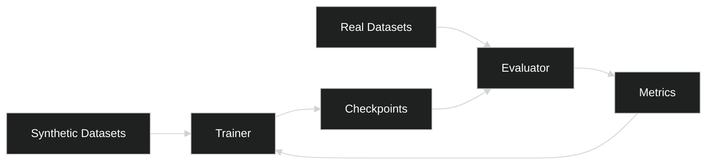

# Sim2Real — Logical (RM-ODP)

## Interfaces
- Dataset registry: list/register/delete datasets.
- Trainer: start/stop runs, resume checkpoints.
- Evaluator: submit model, return metrics.

## Contracts
- Gap metrics: `{pose_error, part_ap, equivariance_score}` with splits.

## Workflows
- Randomize → Train → Evaluate → Adapt → Re-evaluate.

## Components & Data

