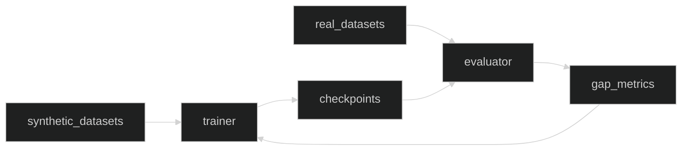

# Sim2Real — Logical

## Interfaces
- Dataset registry: list/register datasets; schema validation
- Trainer API: start/stop runs; resume from checkpoint
- Evaluator: submit model; return metrics JSON and overlays

## Data Schemas
- Scenario: `{id, domain_params, seed}`
- Run: `{id, scenario_id, started_at, finished_at, artifacts: [...]}`
- Metric: `{name, value, split, object}`

## Workflow
Randomize → train → evaluate on real sets → analyze gap → adapt → iterate.

## Error Handling
- Invalid datasets: quarantine and report
- Training failures: restart with backoff; notify maintainers
- Metric anomalies: alert thresholds

## Observability
- Prometheus: training time/epoch, eval throughput, gap metrics
- Logs: structured, include seeds and parameter hashes

## Data Flow

