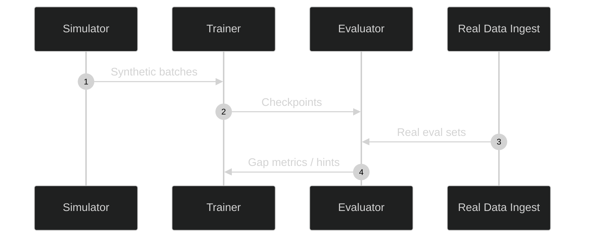
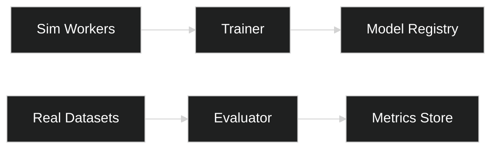
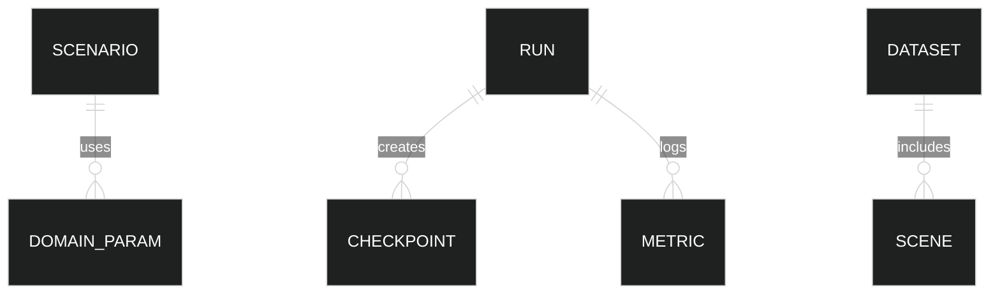
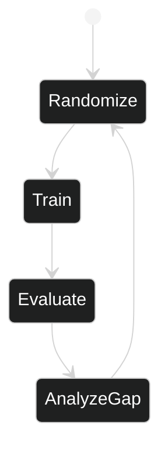

# Sim2Real Architecture Diagrams

## Sequence (Train → Evaluate → Adapt)

```mermaid
%%{init: { 'theme': 'dark', 'themeVariables': { 'background':'#000', 'primaryTextColor':'#FFF', 'textColor':'#FFF', 'fontSize':'16px' }}}%%
sequenceDiagram
    autonumber
    participant Sim as Simulator
    participant Train as Trainer
    participant Eval as Evaluator
    participant Real as Real Data Ingest
    Sim->>Train: Synthetic batches
    Train->>Eval: Checkpoints
    Real->>Eval: Real eval sets
    Eval->>Train: Gap metrics / hints
```

## Container View (C4)

```mermaid
%%{init: { 'theme': 'dark', 'themeVariables': { 'background':'#000', 'primaryTextColor':'#FFF', 'textColor':'#FFF', 'fontSize':'16px' }}}%%
flowchart LR
  SIM[Sim Workers]-->TRAIN[Trainer]
  REAL[Real Datasets]-->EVAL[Evaluator]
  TRAIN-->REG[Model Registry]
  EVAL-->MET[Metrics Store]
```

## Entity-Relationship (Sim2Real)

```mermaid
%%{init: { 'theme': 'dark', 'themeVariables': { 'background':'#000', 'primaryTextColor':'#FFF', 'textColor':'#FFF', 'fontSize':'16px' }}}%%
erDiagram
  SCENARIO ||--o{ DOMAIN_PARAM : uses
  RUN ||--o{ CHECKPOINT : creates
  RUN ||--o{ METRIC : logs
  DATASET ||--o{ SCENE : includes
```

## State Machine (Adaptation)

```mermaid
%%{init: { 'theme': 'dark', 'themeVariables': { 'background':'#000', 'primaryTextColor':'#FFF', 'textColor':'#FFF', 'fontSize':'16px' }}}%%
stateDiagram-v2
  [*] --> Randomize
  Randomize --> Train
  Train --> Evaluate
  Evaluate --> AnalyzeGap
  AnalyzeGap --> Randomize
```
