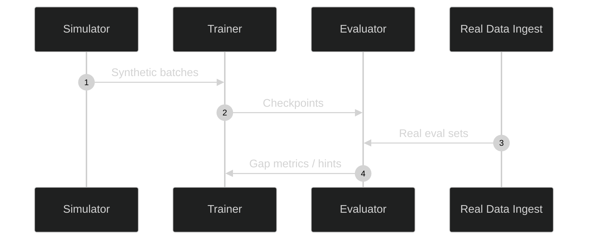
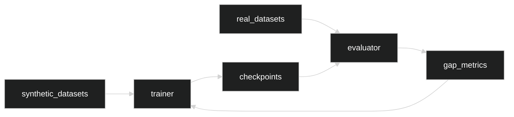

# Sim2Real Architecture Diagrams

## Sequence (Train → Evaluate → Adapt)

```mermaid
%%{init: { 'theme': 'dark', 'themeVariables': { 'background':'#000', 'primaryTextColor':'#FFF', 'textColor':'#FFF', 'fontSize':'14px' }}}%%
sequenceDiagram
    autonumber
    participant Sim as Simulator
    participant Train as Trainer
    participant Eval as Evaluator
    participant Real as Real Data Ingest
    Sim->>Train: Synthetic batches
    Train->>Eval: Checkpoints
    Real->>Eval: Real eval sets
    Eval->>Train: Gap metrics / hints
```

## Data Flow

```mermaid
%%{init: { 'theme': 'dark', 'themeVariables': { 'background':'#000', 'primaryTextColor':'#FFF', 'textColor':'#FFF', 'fontSize':'14px' }}}%%
flowchart LR
    SYN[synthetic_datasets] --> T[trainer]
    REAL[real_datasets] --> E[evaluator]
    T --> CKPT[checkpoints]
    CKPT --> E
    E --> GAP[gap_metrics]
    GAP --> T
```
